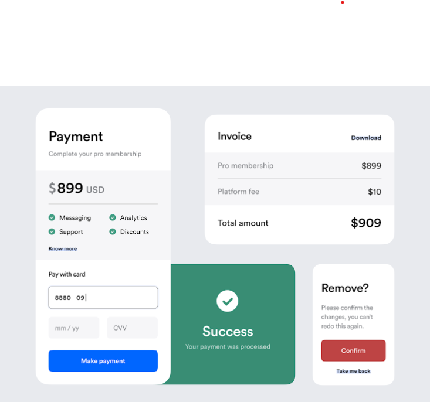

# Sample-form-design
## Design

## Working
Given below is the sample form design page of a Website 
- Each form component is different & chained on below format
- Payment > Remove > Success (after 3 seconds) > Invoice
- You don't need to add validation yet but make sure that each component is linked
